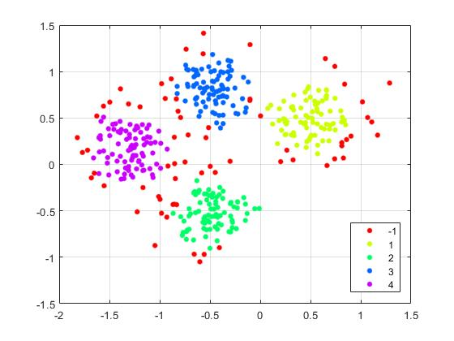
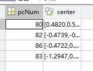
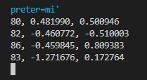
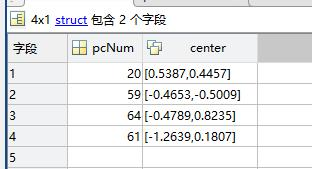
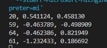

使用C实现matlab的dbscan函数，并将matlab的dbscan函数与我们的C函数对比

#### 参考：

matlab文档： https://ww2.mathworks.cn/help/releases/R2020b/stats/dbscan.html?searchHighlight=dbscan&s_tid=doc_srchtitle#mw_89138510-569d-4439-9beb-75e575e0c814

论文：DBSCAN Revisited, Revisited Why and How You Should (Still) Use DBSCAN

B站视频：https://www.bilibili.com/video/BV114411M7ci/?from=search&seid=18189888639918894760&spm_id_from=333.337.0.0&vd_source=756f40649b668da6bb6e4276020ad242

#### 例子1

参数1， matlab结果：






参数1， c结果，几乎是一样的，误差的来源可能是 dbscan 的结果与点的选取顺序有关：



#### 例子2

更换参数，结果对比如下，也是几乎一样的






#### 例子3

再更换一组参数：


#### 实现细节

```
1. 使用visited用于标记该点是否已经被观察过了，一个点每次从unvisited变成visited，一定是以该点为中心要轮询一遍所有点；
2. 使用neighbor来保存clsuter内的所有点的索引，所有在neighbor内的点，都会最终收录到该cluster中，neighbor中的点，只可能是 unvisited的点 或者是已经visited但却是噪声点
3. 使用addIn来防止重复将点放入到neighbor中，减少查找次数
4. 只可能在一个地方将点置为nosie point，就是在选择第一个core point的时候，该点的邻域点数小于mpts
5. 将一个点置为噪声点后，它还是有机会分到一个cluster中的，比如该点是borrder point的时候。此时它是其他core point 的邻域点的一部分。
```


#### Tips

1. 这只是一个简单的实现，用于简单的毫米波雷达点云应用。点数一般在几十在几百内，簇个数一般在十几个以内。
2. 进一步的，可以预先计算点之间的距离进行优化
3. 更进一步的，可以使用KD树等高级数据结构实现
